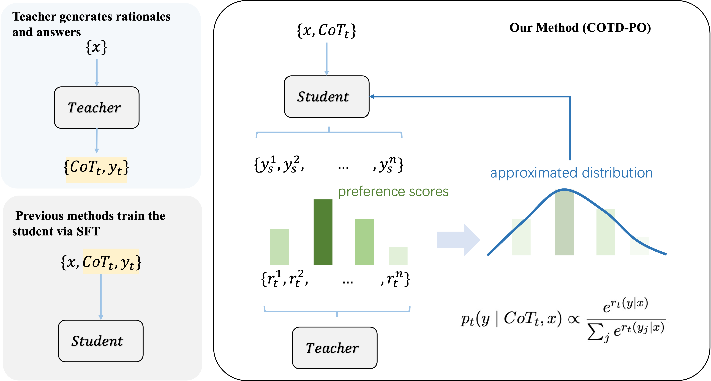

# CoTD-PO: Chain-of-Thought Distillation with Preference Optimization

**CoTD-PO** is a new framework that integrates Chain-of-Thought Distillation (CoTD) with Preference Optimization (PO). It is designed to overcome major limitations of traditional CoT distillation on open-ended generation tasks, including distribution mismatch, performance degradation, and mode collapse.

## ✨ Key Features

1. We use student model's output spaces to avoid training data's distribution mismatch with the training models.
2. We use the preference of black box models (rates from teachers) to appoximate it distributions.
3. We train the student model using a cross-entropy–based objective, treating the teacher-preferred outputs as the target distribution.

