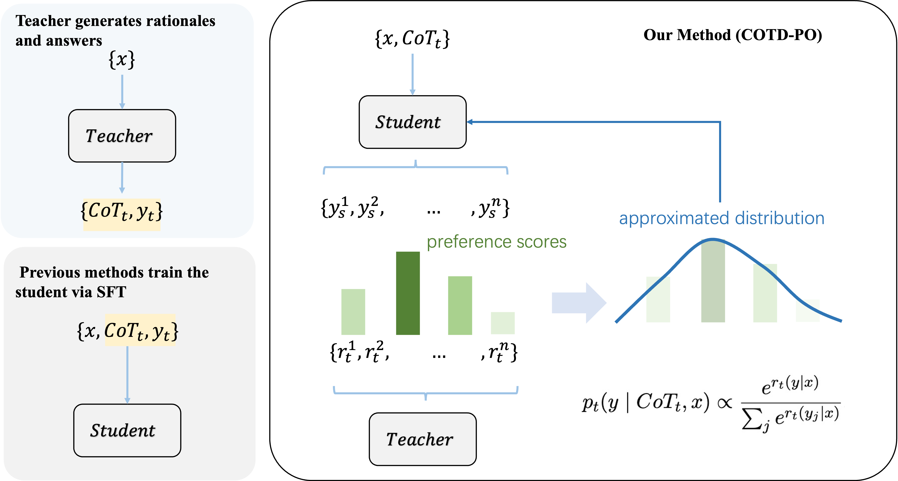

# CoTD-PO: Chain-of-Thought Distillation with Preference Optimization

**CoTD-PO** is a new framework that integrates Chain-of-Thought Distillation (CoTD) with Preference Optimization (PO). It is designed to overcome major limitations of traditional CoT distillation on open-ended generation tasks, including distribution mismatch, performance degradation, and mode collapse. 

CoTD-PO is an On-Policy Distillation (OPD) method designed for transferring reasoning capabilities from a stronger teacher model to a smaller student model in open-ended generation tasks.

Unlike conventional offline distillation, which trains the student on static trajectories pre-generated by the teacher, CoTD-PO allows the student to sample responses from its own current policy during training. The teacher model then provides relative preference feedback over these student-generated candidates, and the student is optimized accordingly.

## ✨ Key Features

1. We use student model's output spaces to avoid training data's distribution mismatch with the training models.
2. We use the preference of black box models (rates from teachers) to appoximate it distributions.
3. We train the student model using a cross-entropy–based objective, treating the teacher-preferred outputs as the target distribution.

